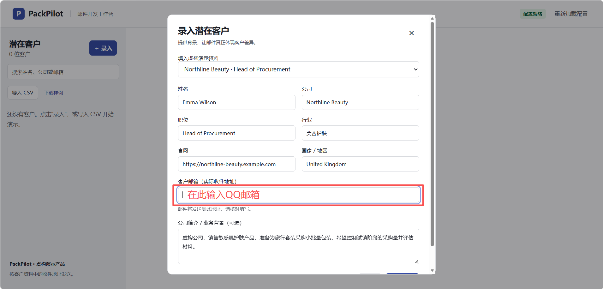
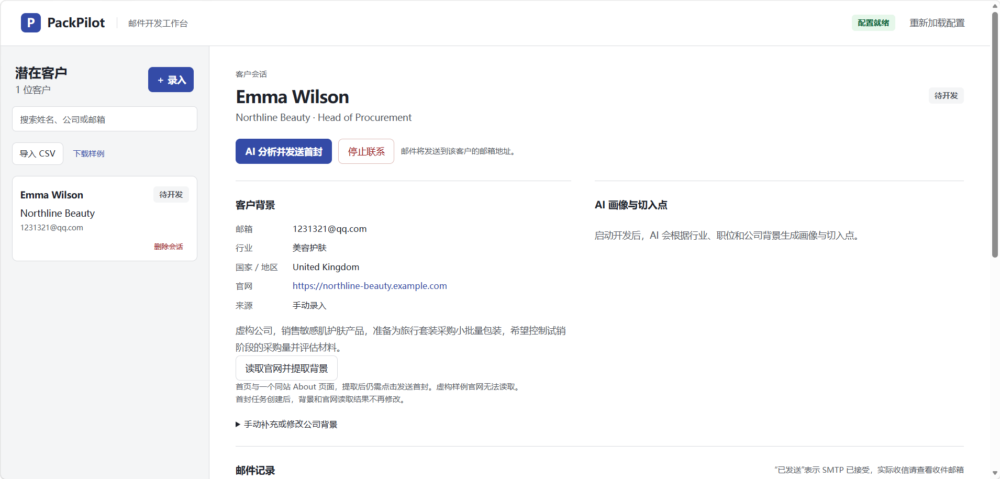
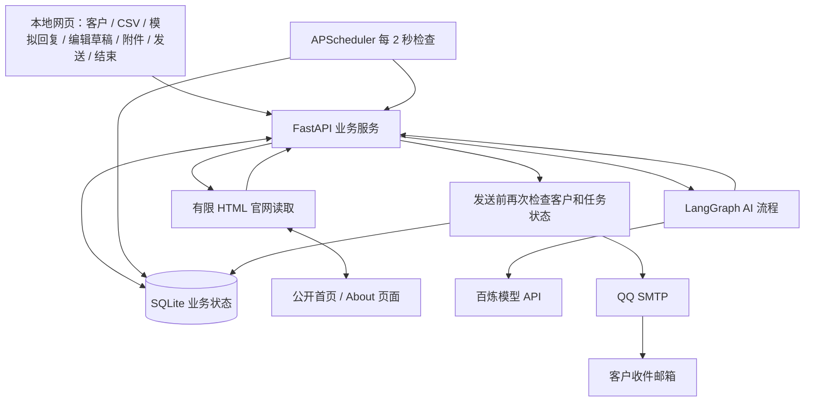

# AI 邮件代发与自动跟进 Demo

本地运行的海外销售获客工作台。手动填写背景或读取真实官网后，真实 AI 生成画像、切入点和英文开发邮件，通过 QQ SMTP 发送；60 秒未录入回复时自动生成并发送一封跟进。录入模拟回复后判断意向、提供建议和可编辑草稿，支持附件及人工确认发送、多轮交流；合作达成可手动标记完成，拒绝、退订或人工停止则标记停止。

交付采用本地运行：从 GitHub 获取代码，在自己的电脑配置凭据并启动。每位使用者的数据和配置独立保存在自己的电脑。

## 快速启动

准备条件：安装 [uv](https://docs.astral.sh/uv/getting-started/installation/)，准备百炼 API Key、QQ SMTP 授权码、获准测试收件地址。项目使用 Python 3.12，uv 可自动下载运行环境。

以下命令适用于 Windows PowerShell。`git clone` 获取默认分支 `main` 的当前版本；已克隆项目时，在项目目录运行 `git pull` 更新。

```powershell
git clone https://github.com/lzh-zzz/AI-Email-FollowUp.git
cd AI-Email-FollowUp
Copy-Item .env.example .env
notepad .env
```

如果已经有 `.env`，保留原文件，不要覆盖。按下表填写 `.env` 并保存，再运行下方的 `run.py` 启动命令：

| 参数 | 填写内容 |
| --- | --- |
| `DASHSCOPE_API_KEY` | 百炼模型调用 API Key |
| `DASHSCOPE_BASE_URL` | 与 Key 地域、业务空间匹配的兼容接口地址，末尾 `/compatible-mode/v1` |
| `DASHSCOPE_MODEL` | 默认 `qwen3.7-flash`，本 Demo 已实测可调用 |
| `SMTP_USERNAME` | 发件人的完整 QQ 邮箱地址 |
| `SMTP_PASSWORD` | 同一邮箱的 SMTP 授权码，**不是 QQ 登录密码** |

北京地域接口格式：

```text
https://业务空间ID.cn-beijing.maas.aliyuncs.com/compatible-mode/v1
```

QQ 邮箱设置中开启 SMTP 服务并生成授权码。默认 `smtp.qq.com:465`、SSL 加密。发件地址用于登录和发送，测试地址用于收信，允许二者相同。不要把授权码写进源码、CSV 或 GitHub。

保存配置后，在项目目录执行以下命令，安装依赖并启动 `run.py`：

```sh
uv sync --locked
uv run --no-sync python run.py
```

完成配置后，Windows 也可双击 `start.bat`，或在项目目录运行：

```powershell
powershell -NoProfile -ExecutionPolicy Bypass -File .\start.ps1
```

其他系统复制 `.env.example` 为 `.env` 并填写配置后，同样运行 `uv sync --locked` 和 `uv run --no-sync python run.py` 启动。

服务就绪后，终端显示“启动成功”和访问地址，并自动打开默认浏览器窗口。默认地址为 **http://127.0.0.1:8000**；修改 `APP_PORT` 后打开对应端口。请保持启动终端开启，按 `Ctrl+C` 停止。首次运行安装锁定依赖和所需 Python，之后通常数秒内启动；凭据准备完成、运行环境和网络可用后可在五分钟内启动。无需前端编译或单独数据库服务。

不使用 uv 时，可在 Python 3.12+ 虚拟环境运行 `python -m pip install -r requirements.txt`，再运行 `python run.py`。测试与开发推荐 uv，以使用完整锁定依赖及测试工具。

### 启动问题排查

- 配置未就绪：核对 `.env` 中的 Key、接口地域／业务空间、发件邮箱和授权码。测试账号不随仓库提供，必须填写自己的凭据。
- uv 自动安装 Python 提示目标目录缺失：先安装正常的 Python 3.12，在项目目录执行 `uv sync --locked --python "C:\实际安装目录\python.exe"`，再运行启动脚本；将示例路径替换为实际路径。
- 页面无法打开：确认启动终端仍在运行，地址为 `http://127.0.0.1:8000`；该地址仅用于运行项目的电脑。
- 配置格式错误、端口占用或应用初始化失败：终端显示“启动失败”和原因，程序以失败状态退出。端口占用时关闭其他运行实例，或修改 `.env` 的 `APP_PORT` 后重启。
- 默认浏览器无法自动打开：终端会提示手动访问地址，已启动的服务继续运行。缺少模型或邮箱凭据时，页面仍可打开，但发信前需补全配置。

## 使用方式

1. 点击“录入”，填写姓名、公司、职位、真实官网、邮箱、行业、国家/地区并保存。公司背景可手动填写，也可暂时留空。虚构样例的 `.example.com` 官网不可读取，演示时使用已提供的虚构背景。
2. 点击“AI 分析并发送首封”。这会真实调用模型并发信；客户资料导入本身不会发送。
3. 查看中文画像、依据与推测、英文邮件、发送状态和 Token 用量。
4. 保持应用运行，不录入回复，约一分钟后发送唯一一封自动跟进。生成与 SMTP 连接增加几秒耗时。
5. 录入模拟回复，查看真实 AI 意向、建议和英文回复草稿。编辑主题、正文，可保存草稿、上传或移除资料附件，然后点击“发送回复邮件”。发送会使用页面当前内容和附件，不再调用模型。
6. 成功后显示“等待下一次回复”。继续录入下一次客户回复，AI 根据最近往来生成新草稿；重复审核和发送。合作谈成后点击“标记合作完成”并确认，客户状态变为“已完成”，会话和邮件记录保留，后续不再发信或录入模拟回复。每次客户回复最多对应一封确认发送的邮件。
7. 录入明确拒绝或退订，或点击“停止联系”，客户状态为“已停止”并显示原因。停止后不能重新开发或发送回复邮件。

录入界面：在“客户邮箱”中填写获准使用的测试收件地址，可以使用 QQ 邮箱。



客户工作台：保存客户资料后，点击“AI 分析并发送首封”开始开发流程。



## 技术栈与架构

- Python 3.12+、FastAPI：本地 API 和静态 HTML/CSS/JavaScript 页面。
- LangGraph：官网背景提取、首封生成、跟进生成、回复分类和停止/草稿分支。
- SQLite：客户、官网读取状态与来源、会话、消息、发送任务、附件文件与操作去重记录；旧数据库启动时自动升级，保留现有记录。
- APScheduler：每 2 秒检查数据库的到期任务。
- 百炼 OpenAI 兼容接口：`qwen3.7-flash`，默认关闭深度思考。
- Python 标准库 `smtplib`：QQ SMTP SSL/TLS 真实发送。



本地组件在同一进程。LangGraph 负责 AI 分支，数据库负责持久业务状态，调度器负责计时。模型不会自行循环调用发信工具。画像和首封合并一次调用，回复摘要、意向和草稿合并一次调用，跟进复用已保存画像以控制 Token。

目录：`app/` 后端；`static/` 页面与 CSV；`tests/` 测试；`scripts/` 服务检查与 AI 验证工具；`docs/demo-guide.md` 演示讲稿。运行时在本地生成 `data/demo.db`，保存客户、会话、邮件任务和附件。

## 异常与防重复

| 异常 | 行为 |
| --- | --- |
| 模型限流、超时、临时 5xx | 最多额外两次退避重试，失败保存原因 |
| Key / 模型权限异常 | 明确报错，修正配置后手动重试 |
| 模型结构异常或已识别的违规内容 | 最多一次重新生成，仍不合格不发送 |
| QQ 授权失败、SMTP 明确拒收 | 保存原因；重试原任务，有效正文不重复生成 |
| 提交时断线或重启前停在发送中 | 标记“结果待核实”，禁止重发，需人工查收件箱 |
| 重复点击、调度器重复触发 | 操作标识、唯一任务约束、原子领取防重复 |
| 回复或停止与跟进并发 | 回复先保存并取消未发任务；发送前再次检查状态 |
| 应用重启 | 恢复到期检查，已发送/已取消任务不再执行 |

内容校验包含主题换行、字段、枚举、长度，以及部分明确的未提供承诺与占位符。它不能证明所有文本事实正确，演示前应阅读生成内容；本项目不作为生产营销系统直接使用。

## 5–10 分钟演示

按 [演示讲稿](docs/demo-guide.md) 执行。使用一位客户演示首封 → 等待一分钟 → 自动跟进 → 录入回复 → 判断意向 → 多轮人工回复 → 手动标记合作完成。要展示“倒计时内回复会取消跟进”，用另一个不同邮箱的测试客户。

只有一个测试邮箱而需要重新演示时，先停止应用，将整个 `data` 目录**改名保留为备份**，再重新启动。应用创建新数据库，原记录仍在备份目录，可在停止应用后恢复。不要在运行中修改数据库。

## 已知限制

- 回复仅在页面手动模拟；QQ 收件箱收到回复不会自动被识别。
- 每个客户最多一封首封和一封未回复自动跟进；客户回复后支持多轮人工确认发送，等待下一次回复期间不再安排自动跟进；已停止和已完成的会话不恢复发送。
- 官网仅支持有限公开 HTML 页面读取，动态网站、验证码、登录和访问限制可能导致失败；可手动补充背景。
- 仅本地单进程，默认 `127.0.0.1`，无多用户验证，不配置多个 worker。
- 关闭或休眠时不执行任务；重启后处理仍符合条件的到期任务。
- SMTP 不保证外部投递恰好一次；不查询垃圾邮件、退信或已读状态。
- `data/` 保存测试邮箱、往来内容与附件；`.env`、数据库和联调结果不提交到 Git。
