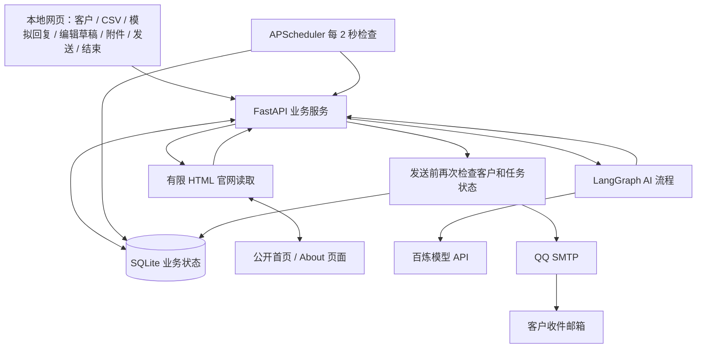

# AI 邮件代发与自动跟进 Demo

本地运行的海外销售获客工作台。手动填写背景或读取真实官网后，真实 AI 生成画像、切入点和英文开发邮件，通过 QQ SMTP 发送；60 秒未录入回复时自动生成并发送一封跟进。录入模拟回复后判断意向、提供建议和可编辑草稿，支持附件及人工确认发送、多轮交流；合作达成可手动标记完成，拒绝、退订或人工停止则标记停止。

产品 **PackPilot** 和三组客户公司均为虚构演示资料。邮件确实发出，系统可向任意格式有效的客户邮箱发送。开发联调使用本人或公司提供的测试邮箱。

## 快速启动

准备条件：安装 [uv](https://docs.astral.sh/uv/getting-started/installation/)，准备百炼 API Key、QQ SMTP 授权码、获准测试收件地址。`gh` 不是启动依赖。

```powershell
git clone https://github.com/lzh-zzz/AI-Email-FollowUp.git
cd AI-Email-FollowUp
Copy-Item .env.example .env
```

如果已经有 `.env`，保留原文件，不要覆盖。编辑 `.env`：

| 参数 | 填写内容 |
| --- | --- |
| `DASHSCOPE_API_KEY` | 百炼模型调用 API Key |
| `DASHSCOPE_BASE_URL` | 与 Key 地域、业务空间匹配的兼容接口地址，末尾 `/compatible-mode/v1` |
| `DASHSCOPE_MODEL` | 默认 `qwen3.7-flash`，本 Demo 已实测可调用 |
| `SMTP_USERNAME` | 发件人的完整 QQ 邮箱地址 |
| `SMTP_PASSWORD` | 同一邮箱的 SMTP 授权码，**不是 QQ 登录密码** |

北京地域接口格式：

```text
https://业务空间ID.cn-beijing.maas.aliyuncs.com/compatible-mode/v1
```

QQ 邮箱设置中开启 SMTP 服务并生成授权码。默认 `smtp.qq.com:465`、SSL 加密。发件地址用于登录和发送，测试地址用于收信，允许二者相同。不要把授权码写进源码、CSV 或 GitHub。

Windows 双击 `start.bat`，或在项目目录运行：

```powershell
powershell -NoProfile -ExecutionPolicy Bypass -File .\start.ps1
```

跨平台也可直接运行：

```sh
uv sync --locked
uv run --no-sync python run.py
```

打开 **http://127.0.0.1:8000**。首次运行安装锁定依赖和所需 Python；之后通常数秒内启动。`Ctrl+C` 停止。凭据准备完成、运行环境和网络可用后可在五分钟内启动。无需前端编译或单独数据库服务。

不使用 uv 时，可在 Python 3.12+ 虚拟环境运行 `python -m pip install -r requirements.txt`，再运行 `python run.py`。开发验收推荐 uv，以使用完整锁定依赖及测试工具。

## 使用方式

1. 点击“录入”，填写姓名、公司、职位、真实官网、邮箱、行业、国家/地区并保存。公司背景可手动填写，也可暂时留空。虚构样例的 `.example.com` 官网不可读取，演示时使用已提供的虚构背景。
2. 点击“AI 分析并发送首封”。这会真实调用模型并发信；客户资料导入本身不会发送。
3. 查看中文画像、依据与推测、英文邮件、发送状态和 Token 用量。
4. 保持应用运行，不录入回复，约一分钟后发送唯一一封自动跟进。生成与 SMTP 连接增加几秒耗时。
5. 录入模拟回复，查看真实 AI 意向、建议和英文回复草稿。编辑主题、正文，可保存草稿、上传或移除资料附件，然后点击“发送回复邮件”。发送会使用页面当前内容和附件，不再调用模型。
6. 成功后显示“等待下一次回复”。继续录入下一次客户回复，AI 根据最近往来生成新草稿；重复审核和发送。合作谈成后点击“标记合作完成”并确认，客户状态变为“已完成”，会话和邮件记录保留，后续不再发信或录入模拟回复。每次客户回复最多对应一封确认发送的邮件。
7. 录入明确拒绝或退订，或点击“停止联系”，客户状态为“已停止”并显示原因。停止后不能重新开发或发送回复邮件。

此前人工停止、但首封已成功发送的会话，也可改标为“已完成”；明确拒绝或退订的会话不能改标。

附件单个最多 5MB，每封最多 5 个，总计 10MB；发送记录与时间线可以下载已发送附件。附件只属于当前回复，不自动带入下一轮。文件保存在本地 SQLite，AI 仅参考历史附件文件名，不读取文件内容。正文声称已附资料却没有附件时，发送被阻止；请上传文件或修改正文。

发送任务创建后主题、正文和附件固定。明确发送失败时，在邮件记录中点击“修正后重试此任务”；重试原内容和附件，避免重复生成或另建任务。结果待核实时需人工查看收件箱，系统禁止再次发送。

下载 CSV 样例，替换示例邮箱再导入。支持中文或英文表头、UTF-8（含 BOM）、最多 100 行 / 250 KB；逐行报告错误和重复。数据库按标准化邮箱去重，一个邮箱地址只能对应一个客户。

收件地址直接来自客户资料，无需配置白名单。旧的 `TEST_RECIPIENTS` 参数不再读取，可删除。

客户列表中每条记录均有“删除会话”。确认后永久清理该客户资料、往来消息、发送任务、草稿、附件、官网读取和操作记录；已经发到邮箱的邮件不会撤回。官网读取、AI 分析或 SMTP 提交正在执行时禁止删除，待完成后重试。删除当前会话后详情回到空白页；删除后可重新录入同一邮箱，作为新的演示会话，原记录不会恢复。旧任务标识不复用，排队任务和旧页面请求不能误操作新记录。

凭据变更后点击“重新加载配置”，任务执行时暂不允许加载。修改监听地址或端口需要重启。同名系统环境变量优先于 `.env`。

### 读取真实官网

保存一位新客户后，在“客户背景”中点击“读取官网并提取背景”。系统读取该链接和最多一个同站 About 页面，由百炼提取公司业务摘要和原文依据，保存来源与 Token 用量。可以展开依据并打开原始页面核对。读取本身不发信，确认背景后再点击“AI 分析并发送首封”。公司名、行业、职位、国家和收件邮箱仍由用户录入，网站不能改写这些字段。

人工背景和官网摘要分别保存；首封生成时同时参考两者，不重复传整个网页。没有任何可用背景时禁止首封。读取失败时可重新读取，或展开“手动补充或修改公司背景”填写并保存；About 页面单独失败时，可继续使用首页并显示提示。创建首封任务后不能重新读取或改写背景，避免改变已有邮件依据。

每页 HTML 和解压后内容均限制为 1MB，提取首页最多 4000 字符、About 最多 3000 字符，读取预算约 30 秒。只读取公网 HTTP/HTTPS 默认端口，不访问内网，不登录、不执行网页 JavaScript、不处理验证码。需要登录、JavaScript 渲染或限制自动访问的网站可能失败；本地环境需能直接连接官网。官网内容和 AI 摘要需要用户核对，网站自述不等于独立核实。

## 技术栈与架构

- Python 3.12+、FastAPI：本地 API 和静态 HTML/CSS/JavaScript 页面。
- LangGraph：官网背景提取、首封生成、跟进生成、回复分类和停止/草稿分支。
- SQLite：客户、官网读取状态与来源、会话、消息、发送任务、附件文件与操作去重记录；旧数据库启动时自动升级，保留现有记录。
- APScheduler：每 2 秒检查数据库的到期任务。
- 百炼 OpenAI 兼容接口：`qwen3.7-flash`，默认关闭深度思考。
- Python 标准库 `smtplib`：QQ SMTP SSL/TLS 真实发送。



本地组件在同一进程。LangGraph 负责 AI 分支，数据库负责持久业务状态，调度器负责计时。模型不会自行循环调用发信工具。画像和首封合并一次调用，回复摘要、意向和草稿合并一次调用，跟进复用已保存画像以控制 Token。

目录：`app/` 后端；`static/` 页面与 CSV；`tests/` 测试；`scripts/` 联调工具；`data/demo.db` 本地数据库；`docs/demo-guide.md` 演示讲稿。规格见 `SPEC.md`，术语见 `CONTEXT.md`。

## 异常与防重复

| 异常 | 行为 |
| --- | --- |
| 模型限流、超时、临时 5xx | 最多额外两次退避重试，失败保存原因 |
| Key / 模型权限异常 | 明确报错，修正配置后手动重试 |
| 模型结构异常或已识别的违规内容 | 最多一次重新生成，仍不合格不发送 |
| QQ 授权失败、SMTP 明确拒收 | 保存原因；重试原任务，有效正文不重复生成 |
| 提交时断线或重启前停在发送中 | 标记“结果待核实”，禁止重发，需人工查收件箱 |
| 重复点击、调度器重复触发 | 操作标识、唯一任务约束、原子领取防重复 |
| 回复或停止与跟进并发 | 回复先保存并取消未发任务；发送前再次检查状态 |
| 应用重启 | 恢复到期检查，已发送/已取消任务不再执行 |

内容校验包含主题换行、字段、枚举、长度，以及部分明确的未提供承诺与占位符。它不能证明所有文本事实正确，演示前应阅读生成内容；本项目不作为生产营销系统直接使用。

## 测试与真实验收

```sh
uv run pytest -q
uv run ruff check app scripts tests run.py
```

自动测试使用临时 SQLite、真实 LangGraph 及外部模型/SMTP 替身，不发真实邮件。覆盖到期、重复/并发、取消跟进、拒绝/退订、模型异常、SMTP 失败/不确定结果和重启恢复。

官网测试还替换网络边界，覆盖读取状态、两页提取、原文引用校验、失败后手动补充、重复点击、内网重定向拒绝、连接固定到已检查 IP，以及压缩内容大小限制。

下列工具读取本地配置并产生真实模型费用，**均不发送邮件**：

```sh
uv run python -X utf8 scripts/check_services.py
uv run python -X utf8 scripts/verify_ai.py
```

前者调用一次 AI 并验证 QQ SMTP 登录；后者生成三组客户邮件并分析五类回复。结果在被 Git 忽略的 `artifacts/`。真实邮件通过页面验收，并人工查看测试邮箱；“SMTP 已接受”不等于已到达收件箱。

测试账号不随仓库提供，每位演示者填写自己的百炼 Key、QQ 授权码和测试邮箱。应用无需登录。验收记录见 `docs/verification.md`。

## 5–10 分钟演示

按 [演示讲稿](docs/demo-guide.md) 执行。使用一位客户演示首封 → 等待一分钟 → 自动跟进 → 录入回复 → 判断意向 → 多轮人工回复 → 手动标记合作完成。要展示“倒计时内回复会取消跟进”，用另一个不同邮箱的测试客户。

只有一个测试邮箱而需要重新演示时，先停止应用，将整个 `data` 目录**改名保留为备份**，再重新启动。应用创建新数据库，原记录仍在备份目录，可在停止应用后恢复。不要在运行中修改数据库。

## 已知限制

- 回复仅在页面手动模拟；QQ 收件箱收到回复不会自动被识别。
- 每个客户最多一封首封和一封未回复自动跟进；客户回复后支持多轮人工确认发送，等待下一次回复期间不再安排自动跟进；已停止和已完成的会话不恢复发送。
- 官网仅支持有限公开 HTML 页面读取，动态网站、验证码、登录和访问限制可能导致失败；可手动补充背景。
- 仅本地单进程，默认 `127.0.0.1`，无多用户验证，不配置多个 worker。
- 关闭或休眠时不执行任务；重启后处理仍符合条件的到期任务。
- SMTP 不保证外部投递恰好一次；不查询垃圾邮件、退信或已读状态。
- `data/` 保存测试邮箱、往来内容与附件；`.env`、数据库和联调结果不提交到 Git。
