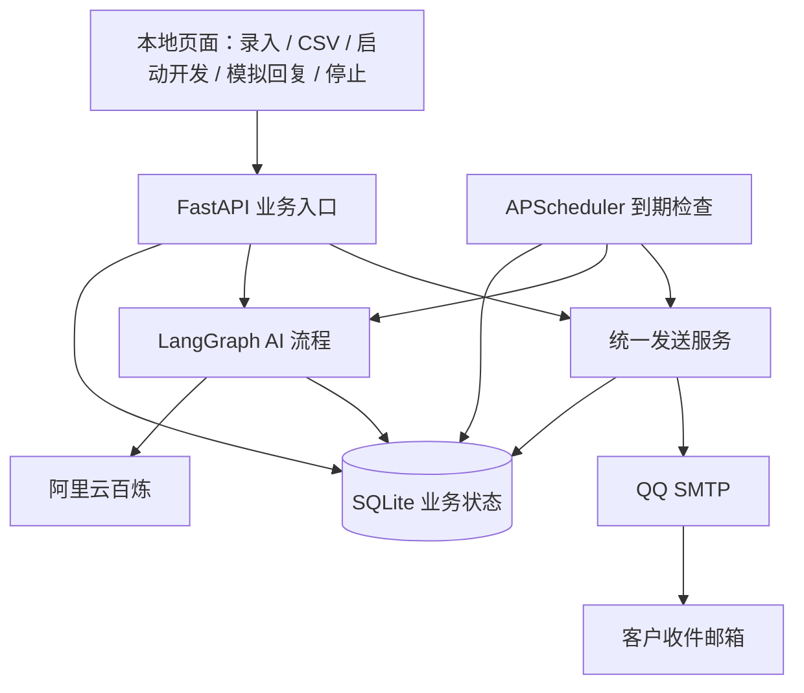

# AI 邮件代发与自动跟进系统 — Demo 规格

日期：2026-09-30。依据当前讨论和项目业务术语整理。

状态：规格草案已整理，按用户配置后的开发指示完成本地实现；测试边界沿用下述推荐方案，未另行收到正式规格确认。实际验收记录见 docs/verification.md。交付采用本地规格文档，本次不拆票或发布远程 Issue。

2026-09-30 更新：按用户要求取消收件白名单，发送目标为客户资料中任意格式有效的邮箱；首封、跟进和失败重试采用相同规则。开发测试继续使用本人或公司提供的测试账号。

## Problem Statement

海外销售希望导入潜在客户后，由 AI 理解客户的行业、职位和公司背景，生成有针对性的开发邮件并真实发送。在客户未回复时自动跟进，在收到回复时判断意向，在明确拒绝、退订或人工停止后不再自动跟进。

本项目用于展示这一条完整业务链路。重点是功能正确、状态可追踪、真实 AI 和真实邮件发送可验证，并且配置完成后可在本地五分钟内启动。

## Solution

提供一个本地网页应用，支持客户录入与 CSV 导入、客户画像和切入点展示、个性化邮件生成、QQ 邮箱 SMTP 真实发送、一次定时自动跟进，以及模拟客户回复后的意向判断和回复草稿。

已确认的边界：

- 演示产品使用虚构设定；客户画像基于录入资料，可在首封任务创建前读取真实公开官网提取背景。
- 使用阿里云百炼真实模型调用；发信使用 QQ 邮箱 SMTP 和邮箱授权码。
- 客户回复在界面手动录入，明确标记为模拟回复，不读取邮箱收件箱。
- 首封发送成功后等待 60 秒；未录入回复时，最多自动发送一封跟进邮件。
- 录入任何客户回复后取消未发送的跟进任务；AI 生成英文回复草稿，用户编辑、上传附件并点击发送后进入等待下一次回复，可持续多轮交流。
- 明确拒绝、退订或人工停止后禁止继续自动跟进。

沿用已讨论的技术建议作为规格默认方案：虚构产品 PackPilot 定制环保包装服务；Python、FastAPI、简单 HTML 页面、LangGraph、SQLite、APScheduler；模型 qwen3.7-flash，显式关闭深度思考。模型名称和跟进间隔允许通过配置调整。默认界面使用中文，开发邮件使用英文。

## User Stories

1. 作为演示者，我希望配置百炼 API Key、QQ 邮箱授权码和获准测试的收件地址，以便使用真实外部能力运行演示。
2. 作为演示者，我希望在没有配置凭据时看到缺少的配置项，以便知道如何完成准备。
3. 作为演示者，我希望录入姓名、公司、职位、官网、邮箱、行业、国家或地区及公司背景，以便提供客户分析所需的信息。
4. 作为演示者，我希望导入 CSV 并看到每行的导入结果，以便快速准备多个演示客户。
5. 作为演示者，我希望错误邮箱、缺失字段和重复客户有明确反馈，以便避免错误发信或重复开发。
6. 作为演示者，我希望使用三组不同行业、职位和背景的样例客户，以便观察个性化差异。
7. 作为演示者，我希望 AI 给出客户画像、切入点及依据，以便看懂邮件为何这样写。
8. 作为演示者，我希望 AI 区分已知资料与推测，以便避免将编造的公司事实写入邮件。
9. 作为演示者，我希望看到并保存首封邮件主题和正文，以便检查内容与客户背景的关联。
10. 作为演示者，我希望启动一位客户的开发流程后完成分析、邮件生成和真实发送，以便展示从输入到动作的完整过程。
11. 作为演示者，我希望直接向录入的客户邮箱发送，无需维护收件白名单，同时继续校验邮箱格式。
12. 作为演示者，我希望看到发送时间、状态、失败原因和尝试次数，以便理解流程是否成功。
13. 作为演示者，我希望首封发送成功后显示跟进截止时间，以便观察自动跟进的触发条件。
14. 作为演示者，我希望客户未回复时收到 AI 新生成的一封跟进邮件，以便验证跟进不是原文重复发送。
15. 作为演示者，我希望每轮只自动跟进一次，以便流程有明确的结束边界。
16. 作为演示者，我希望在客户会话中录入模拟回复，以便触发真实 AI 意向判断。
17. 作为演示者，我希望录入回复后先取消待发送跟进，即使 AI 分析失败也不恢复发信，以便防止继续执行未回复流程。
18. 作为演示者，我希望查看高、中、低、拒绝的意向判断、理由及下一步建议，以便理解客户回复的含义。
19. 作为演示者，我希望审核并编辑 AI 回复草稿、添加资料附件并点击发送，然后录入下一次客户回复继续交流，直到不再需要回复或结束会话。
20. 作为演示者，我希望明确拒绝或退订被记录为停止跟进，以便验证停止条件。
21. 作为演示者，我希望人工停止客户开发，以便随时取消尚未发送的跟进。
22. 作为演示者，我希望重复点击和调度器重复触发不导致重复发信，以便安全地重复操作界面。
23. 作为演示者，我希望重启应用后仍能查看客户、邮件和意向结果，并恢复检查到期任务，以便验证状态确实持久保存。
24. 作为演示者，我希望在模型调用或 SMTP 失败时看到可执行的处理建议，以便排查配置和服务问题。
25. 作为演示者，我希望发送结果不确定时系统暂停并要求人工核实，以便避免同一封邮件被重复发送。
26. 作为演示者，我希望按 README 和演示步骤完成一次五至十分钟的演示，以便验证交付完整性。

## Implementation Decisions

### 运行与职责

- 本地单进程运行，HTTP 服务和定时任务使用同一份业务数据库；不启用多个服务 worker 或多个调度器实例。
- LangGraph 编排客户分析、邮件生成和回复分析等有条件分支的 AI 步骤；不让模型自行循环调用发送工具。
- APScheduler 周期性检查数据库中的到期发送任务；等待一分钟通过持久化截止时间实现，不在模型调用或图节点中休眠。
- SQLite 是业务状态的权威来源；LangGraph 执行状态不能代替客户、会话和发送任务记录。
- UI、定时任务通过同一套业务操作检查发送条件和停止状态；不会各自实现独立的发信规则。
- 启动开发、录入回复和重试使用稳定的操作标识处理请求重放；同一操作标识重复提交返回已有结果。同一正文由用户作为不同操作再次提交，不自动认定为请求重放。

### 演示资料和导入

- PackPilot、卖点和样例公司背景均为虚构演示设定，界面和 README 明确标注。
- PackPilot 的示例卖点为小批量定制、可回收材料和样品打样；不添加未经提供的价格、认证、成功客户或量化承诺。
- 单个录入与 CSV 使用相同字段校验；必需字段为姓名、公司、职位、官网、邮箱、行业、国家或地区。公司背景可选；启动首封前必须有人工背景或成功提取的官网背景。
- CSV 支持 UTF-8（含 BOM），提供中文列名样例；按行返回成功、跳过或失败结果及原因。
- 同一标准化邮箱仅保留一个潜在客户，不使用 Gmail 专属的别名规则合并其他邮箱地址。重复导入跳过并说明原因，不覆盖已有会话。
- 演示数据可以使用虚构姓名和公司，但真实发送的收件地址必须由用户替换为获准测试的邮箱。
- 导入和生成资料本身不批量触发发送；在单个客户详情中启动开发流程。

### 基础数据

官网读取记录独立保存状态、页面 URL/标题/有限正文、摘要、原文依据、警告、失败原因及模型用量；不会覆盖人工背景或历史邮件。

| 数据 | 至少保存的业务信息 |
| --- | --- |
| Lead | 基础字段、公司背景、来源、客户画像、切入点、分析依据、客户状态、意向等级、停止原因、创建和更新时间 |
| Email Task | 所属客户与会话、首封/跟进/人工回复类型、对应客户回复、主题、正文、计划发送时间、发送状态、尝试次数、失败原因、稳定的邮件标识、实际提交时间 |
| Conversation | 客户归属、往来内容、邮件方向、回复来源、AI 摘要、最近一次意向、判断理由、下一步建议及回复草稿 |
| Attachment | 所属客户、对应客户回复及发送任务、文件名、类型、大小、摘要与文件内容 |

AI 结果、模型名称和调用 Token 用量随相应分析或邮件记录保存。业务时间保存为 UTC，界面按 Asia/Shanghai 展示。

### 客户状态和发送状态

客户状态和意向等级独立。一次开发对应一条会话；本 Demo 不支持为同一客户自动开启第二轮。

| 客户状态 | 含义与转换 |
| --- | --- |
| 待开发 | 尚未成功发送首封；允许首次启动开发，已有失败任务按原任务处理 |
| 等待回复 | 首封已被 SMTP 接受，存在计划跟进任务 |
| 跟进结束 | 唯一一封跟进已被 SMTP 接受，不再安排更多自动跟进；仍允许录入回复 |
| 已回复 | 客户回复已保存，未发送的跟进取消；意向分析可成功或失败 |
| 等待下一次回复 | 人工回复邮件已被 SMTP 接受，等待录入下一次客户回复，不安排新的自动跟进 |
| 已停止 | 明确拒绝、退订或人工停止／结束会话，禁止继续自动跟进与人工发送回复 |

发送任务状态包括待处理、处理中、发送中、已发送、失败、已取消和结果待核实。发送失败不通过意向等级表示。

- 首封只有在 SMTP 明确返回接受结果后才记为已发送并建立跟进截止时间。
- SMTP 接受邮件表示服务端已接受投递，不代表收件箱已收到；UI 不宣称投递成功或已读。
- 客户状态为已回复或已停止时，调度器不触发跟进；首封或跟进存在待核实发送结果时，整条会话暂停发送。
- 已停止状态不会被稍后返回的 AI 结果覆盖；再次录入回复可以更新会话，但不能恢复自动跟进。

### 首封与自动跟进

用户追加官网读取：新客户保存后可点击读取，获取公开首页和最多一个同站 About 链接。HTMLParser 提取正文，首页限 4000 字符、About 限 3000 字符；每页 HTML 和解压后数据限 1MB。网络连接固定到已检查的公网 IP，保持 HTTPS 域名证书验证，重定向重新检查；拒绝内网/本机/保留/组播目标及非默认端口。读取预算约 30 秒，不执行脚本、不登录、不绕过访问限制。

LangGraph 单次模型步骤返回中文公司背景与 1–5 条带来源 URL 的原文引用，引用必须在输入页面中匹配；无效结果最多修复一次。主页失败时显示错误，About 单独失败时用首页继续并提示。读取不会发信；用户核对摘要后另行启动首封，官网仍在读取时禁止启动首封。首封使用摘要和依据，避免重复传网页。无背景时必须成功读取或手动补充；已有首封任务后禁止重读或修改背景。

1. 校验客户资料和发送凭据，收件地址取自客户资料。
2. 一次真实 AI 调用返回客户画像、切入点、依据和首封主题与正文；校验结果后保存并展示。
3. 通过统一发送服务提交首封邮件；成功后保存发送结果并创建截止时间为提交成功后 60 秒的唯一跟进任务。
4. 到期后先检查客户仍在等待回复、未停止、未跟进且无待核实发送。
5. 根据已保存画像和首封内容调用真实 AI 生成新的跟进邮件；不重复执行客户分析。
6. 在进入 SMTP 发送前再次检查客户状态及任务归属，再发送并记录结果。跟进成功后结束本轮自动开发。

跟进内容需要延续同一产品和切入点、提供一个简短的新沟通角度，并避免虚构新的公司事实。首封与跟进均使用保存的稳定邮件标识；跟进设置回复关联信息，但不保证所有邮箱客户端一定聚合为同一邮件线程。

### 模拟回复与停止规则

- 回复入口绑定一个明确客户会话，记录正文、录入时间及模拟来源。未成功发送首封的会话不接受模拟客户回复。
- 保存回复与取消未发送跟进作为一次业务状态变更完成，然后才调用 AI。AI 调用失败时，已回复状态和取消结果保持有效。
- AI 输出意向、理由、摘要、下一步建议和可选回复草稿。意向以高、中、低、拒绝为主；证据不足时允许留空，并解释无法判断。
- 明确退订和明确拒绝优先于兴趣等级，记录停止原因，不生成继续营销的草稿。
- 无论高、中、低还是无法判断，回复草稿均等待用户审核后点击发送；AI 不能自行发送回复。
- 人工停止立即记录停止原因并取消可取消的发送任务。停止后不提供自动恢复或重新开发功能。
- 客户背景和回复正文是待分析资料，不能作为改写系统规则、修改收件地址或指挥外部发送的指令。
- 回复或人工停止发生在跟进生成期间时，生成结束后的再次检查必须阻止发送。
- 发送前的最后检查作为发信起点；已进入 SMTP 提交的邮件不能撤回。若回复或停止发生在提交期间，保留真实发送结果并停止后续动作，界面说明该邮件已经开始提交。

### 回复草稿、附件与多轮交流（用户追加范围）

- 展示可编辑邮件主题与英文正文，支持保存草稿、上传和移除附件、发送回复邮件。AI 根据最近六条往来（每条最多 2000 字符）生成草稿，当前客户回复全文保留；无需继续回复时可以返回空草稿。
- 人工确认发送只提交当前主题、正文与附件，不额外调用模型；每条客户回复最多一封人工发送邮件。重复点击返回原任务；新客户回复取消旧的未发送任务，旧草稿不能发送。
- 附件单个最多 5MB，每封最多五个，总计 10MB；文件以二进制保存到本地 SQLite，并支持下载。附件不自动带入下一次回复。AI 只收到历史文件名，不解析文件内容。
- 生成草稿时禁止虚构已附文件；人工正文声称已附资料但没有上传文件时，发送返回错误并提示修正。
- 创建发送任务后固定内容和附件；明确失败仅能重试原任务，SMTP 结果待核实时禁止重发或进入下一轮发送。上一封仍在处理中也禁止同时提交下一封。
- 发送成功清空当前草稿，状态转为等待下一次回复；用户继续在模拟模块录入下一次回复，重复分析、审核、发送。无需继续交流时点击结束会话；明确拒绝、退订或结束后不允许再次发送。
- 旧数据库启动时迁移并保留客户、消息与任务标识。新版本升级前备份数据库；不清空业务记录。

### 真实 AI 与 Token 控制

- 所有画像、邮件内容和意向判断来自真实百炼调用；自动化测试中的模型替身仅用于验证逻辑，不能作为演示运行结果。
- 关闭深度思考仍属于真实 AI 推理，节省的是额外思维链输出；不以固定模板和字段替换替代模型。
- 画像、切入点和首封合并一次调用；回复摘要、意向、建议及草稿合并一次调用。
- 跟进只传产品资料、已保存画像和必要邮件历史；限制公司背景和模拟回复的输入长度，不附带整页网站或无限历史。
- 首封正文建议 80–150 个英文词，跟进 40–90 个英文词。模型结果使用结构化格式并校验字段、枚举、长度和非空内容。
- 对过长输入明确提示用户缩短，避免静默截断可能包含的拒绝或退订信息。
- 展示实际返回的 Token 用量；接口未返回用量时标记未知，不伪造数值。
- 默认模型是待实际账号验证的配置值；模型不可用时明确报错，不静默替换成固定文案。

### 异常、防重复和恢复

| 情况 | 处理与可观察结果 |
| --- | --- |
| 模型限流、超时或服务错误 | 有上限的退避重试，最多额外两次；失败后记录原因，不发送不完整邮件 |
| API Key 无效或模型无权限 | 不反复重试，提示修正本地配置 |
| 模型格式异常、字段缺失或不合法 | 最多额外一次格式修复请求，仍异常则保存失败原因并停止该步骤；回复任务失败不恢复跟进 |
| SMTP 授权失败或明确拒收 | 记录失败及处理建议；不将其记为已发送，不启动成功后的计时 |
| SMTP 已可能接受邮件但连接断开、超时或进程崩溃 | 标记结果待核实，禁止自动重发，提示人工检查测试收件箱；本 Demo 不保证外部投递恰好一次 |
| 重复点击或定时任务重复触发 | 每个会话的首封及唯一跟进各有数据库唯一约束；每条客户回复最多一封人工发送任务；通过原子领取任务和状态检查，使第二次触发返回已有任务结果 |
| 回复或停止与跟进同时执行 | 先保存回复或停止状态；生成后、发送前再次检查；已开始 SMTP 提交的邮件按真实结果记录 |
| 重启应用 | 恢复检查待处理截止时间；生成阶段遗留任务可重新处理并重查客户状态；已发送或已取消任务不重复执行；遗留发送中任务进入待核实状态 |

对明确失败且可以确认未提交的发送任务，允许用户在修正配置后重试同一个任务，并记录尝试次数；不新建重复发送任务。已发送和结果待核实任务不提供重发操作。AI 生成的有效内容已保存时，邮件重试复用已有内容。

结果待核实的人工核查只用于确认事实，本 Demo 不提供自动推断是否投递或自动补发机制。演示可使用另一个测试客户继续验证。

### 配置与使用边界

- 使用 QQ 邮箱完整地址、授权码、SMTP 主机和端口；默认 SSL/TLS 加密连接，发件人地址与授权账号一致。
- API Key、授权码存放于本地环境变量，凭据文件和运行数据库不提交到代码仓库；日志、错误提示和配置页面不输出明文凭据。
- 不设置收件白名单，不读取 TEST_RECIPIENTS。任何通过客户资料邮箱格式校验的地址均可发送首封、跟进和重试邮件；停止条件和防重复规则继续生效。
- 本地默认仅绑定回环地址，无多用户登录系统；不作为公网生产服务部署。
- 首次安装运行环境和生成邮箱授权码属于准备步骤，README 分开列出；凭据准备完成后的常规启动目标为五分钟内。
- 应用停止或电脑休眠期间不会发信；重启后重新检查到期任务并执行停止状态检查。

## Testing Decisions

### 推荐测试边界（待确认）

以业务 API 作为主要集成测试入口，使用独立 SQLite 测试数据库，观察响应、最终业务状态、会话记录和发送次数。仅替换百炼和 SMTP 两个外部连接边界，并控制测试时间，以便无需真实等待一分钟或重复支付模型调用费用。

测试验证用户可观察行为，不断言内部函数调用顺序、图节点名称或框架实现细节。编写规格时仓库只有初始化说明和需求文档；当前实现已加入 pytest 业务集成与外部适配器测试。

必须覆盖：

1. 单个录入和 CSV 导入，包括缺失字段、错误邮箱和重复邮箱。
2. 启动开发后保存画像、切入点和首封，首封只提交一次，成功后建立正确的跟进截止时间。
3. 无需收件名单配置，任意格式有效的客户邮箱可发送首封和跟进；错误邮箱和凭据缺失时有明确提示。
4. 未到截止时间不发送；到期未回复只发送一次跟进；重复触发不增加发送次数。
5. 录入任意回复取消未发送跟进；意向分析失败后仍取消跟进。
6. 明确拒绝、退订和人工停止后不再跟进，迟到的 AI 结果不能覆盖停止状态。
7. 跟进生成期间录入回复或人工停止，生成结束后不进入 SMTP。
8. 模型请求失败和结构化结果异常有上限的重试，不产生无效邮件发送。
9. SMTP 明确失败、提交结果不确定分别保存为失败和待核实；待核实不自动重发。
10. 重复启动请求、重复录入回复和并发任务领取不产生重复发送或重复处理。
11. 重启后业务记录仍在，到期任务可继续检查，已发送任务不会再发，遗留发送中任务不会盲目重发。
12. 多轮客户回复、草稿编辑保存、附件上传下载和真实 MIME 组装；附件数量与大小限制、旧草稿失效、失败重试原内容、发送期间新回复、停止禁止发送及旧数据库迁移保留记录。

真实能力验收独立进行：

- 使用用户自己的百炼 API Key，为至少三个背景不同的客户生成邮件。人工检查内容实质差异，不能只替换姓名和公司。
- 用真实 AI 分析高、中、低、拒绝和退订示例，核对判断理由与建议；自动化替身测试不能替代这一项。
- 用用户本人或公司提供的邮箱授权码发送首封及自动跟进，在获准测试邮箱实际确认收到主题和正文。
- 页面上至少执行一次首封至到期跟进流程，以及一次首封至录入回复、识别意向和停止流程。
- 页面确认首封生成结果、发送记录、倒计时、意向、草稿和错误提示可读；不因首封生成耗时而重复启动任务。

未配置真实凭据或未收到邮件时，报告相应验收未完成，不宣称真实链路通过。

## Out of Scope

- 整站或批量抓取官网、JavaScript 渲染、登录与验证码处理、搜索引擎检索、知识库和向量数据库。
- 自动读取邮箱回复、IMAP、Gmail API、Outlook 接入和收件 webhook。
- 面向无关第三方的真实开发邮件、批量营销、多个邮箱或多轮营销活动。
- 收到回复后的自动发信、多次未回复跟进、停止后的自动恢复。
- 邮件打开追踪、点击追踪、自动退信处理及外部投递状态查询。
- 多 Agent 协作、Redis/Celery、分布式 worker、多租户和生产部署。
- OAuth Token 刷新逻辑；本方案使用 SMTP 授权码，凭据异常按授权失败处理。
- 自动保证 SMTP 外部投递恰好一次。

## Further Notes

### 架构

所有应用组件在本地同一进程内运行；百炼和 QQ SMTP 为真实外部服务。

### 五至十分钟演示建议

1. 展示配置就绪状态和虚构产品说明，录入或导入三组不同背景的客户。
2. 启动一个获准测试客户，展示 AI 画像、切入点和邮件，并在测试邮箱确认收到首封。
3. 保持运行，不录入回复，展示一分钟后自动跟进和相应发送记录，确认收到跟进。
4. 启动另一个测试客户，在到期前录入感兴趣的模拟回复，展示意向、建议及回复草稿，确认跟进取消。
5. 展示拒绝或退订回复以及人工停止，确认状态和停止原因，检查不会再自动发送。
6. 展示保存的业务记录和已验证的异常处理结果；多个样例允许绑定不同的获准测试邮箱。

### 交付与完成标准

- 代码保存在现有 GitHub 项目仓库，交付时明确说明本地与远程同步状态。
- README 包含运行环境、启动、配置、技术栈、架构、第三方能力、测试邮箱准备、演示步骤和已知限制。
- 提供配置占位示例、CSV 样例和自动化检查方式；不提供或公开真实测试账号密码。
- 完成上述自动化检查和真实能力验收，并说明尚未验证的部分。
- 交付可在配置准备完成后本地五分钟内启动的 Demo，无线上部署要求。
