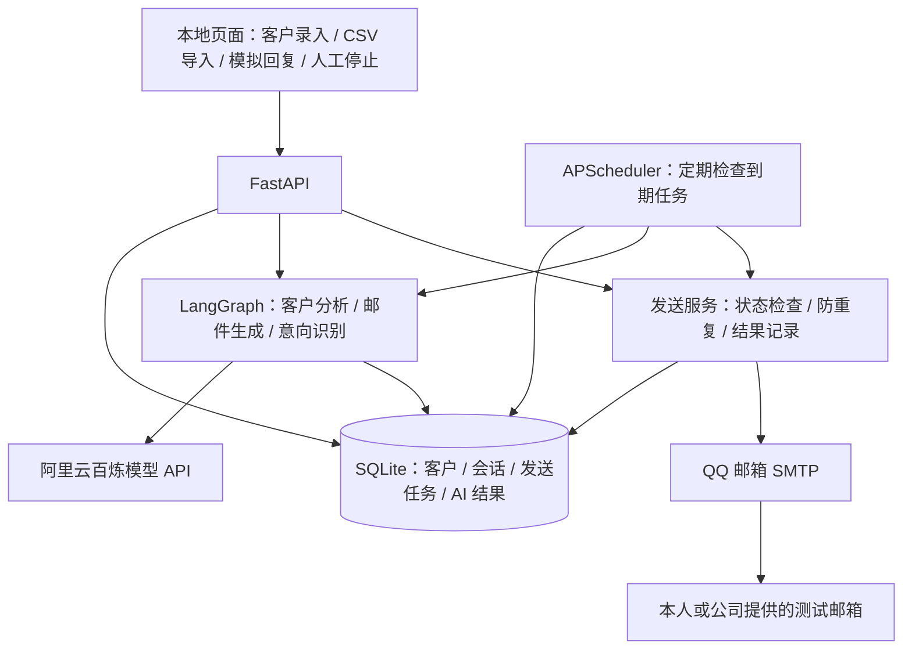

# Demo 范围确认

本文保留需求讨论记录；完整开发与验收规格以项目根目录的 SPEC.md 为准。

## 已确认

- 使用虚构产品演示。
- 邮件渠道选用 QQ 邮箱 SMTP，使用邮箱授权码认证，默认 smtp.qq.com:465（SSL/TLS）。首封邮件和未回复跟进邮件需要真实发送到本人或公司提供的测试邮箱。
- 客户回复使用界面手动录入的模拟回复，不接入邮箱收件读取；界面需要明确标注回复来源。
- 客户画像基于录入资料，不自动抓取官网；官网仅保存为参考链接。
- 在姓名、公司、职位、官网、邮箱、行业、国家或地区之外，增加公司简介／业务背景字段，为画像和切入点提供依据。
- 个性化邮件需要体现行业、公司背景或职位差异；推测与已知资料区分，不编造公司事实。
- 首封邮件发送成功后开始计时，60 秒内未录入客户回复时，自动生成并真实发送一封跟进邮件。
- 每轮开发最多自动跟进一次，之后结束本轮自动开发。
- 录入任何客户回复后，立即取消尚未发送的跟进任务，再由 AI 判断意向并生成建议或回复草稿。
- 回复后的草稿仅展示，不自动发送。
- 模拟回复录入后，由真实 AI 判断意向，并生成下一步建议或回复草稿；明确拒绝、退订或人工标记后停止自动跟进。
- 使用阿里云百炼真实模型调用。
- 以功能正确、轻量、正常运行的 Demo 为交付目标。

## 当前建议，尚未确认

- 演示产品示例：PackPilot，面向海外品牌的定制环保包装服务；小批量定制、可回收材料、样品打样均为虚构演示卖点。
- FastAPI、简单 HTML 页面、LangGraph、SQLite、APScheduler，在本地单进程运行。
- 模型选用 qwen3.7-flash，关闭深度思考，限制上下文和输出长度。

## 交付与验收要求

- 支持单个客户录入和 CSV 导入，包含要求的基础字段及公司背景。
- 可查看并保存客户画像、切入点、邮件主题与正文、发送记录、客户状态和 AI 意向判断。
- 真实发送验收需要在测试邮箱中确认收到邮件；SMTP 接受邮件不等于最终到达收件箱。
- 至少处理 API 失败、模型输出异常、邮件发送失败和重复执行；发送结果不确定时不盲目重发。
- 跟进截止时间保存在数据库中；应用运行时自动处理到期任务，重启后重新检查待处理任务。
- 提供本地启动方式、README、5–10 分钟演示步骤、架构图和代码仓库。
- API Key 与邮箱授权码仅在本地环境变量或 .env 中配置，不提交到仓库。

## 下一项待确认

- 是否接受上述范围及当前建议的演示产品、技术栈和模型，并进入开发。

## 建议架构

图中的各组件在同一个本地应用中运行；SQLite 保存业务状态，调度器负责时间触发，LangGraph 负责 AI 步骤和条件分支。
